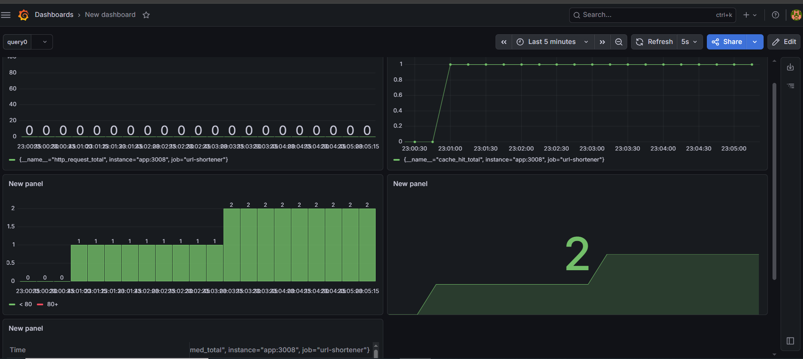
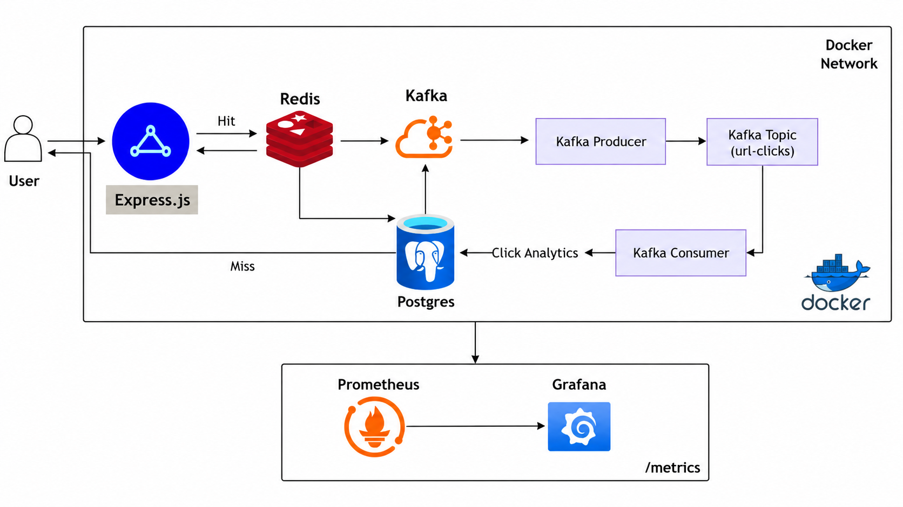

# 🚀 Distributed URL Shortener

A production-ready URL Shortener built using Node.js and modern backend technologies.

## ✨ Features

- 🔐 JWT Authentication
- 🔗 URL Shortening
- ⚡ Redis Caching
- 📊 Click Analytics
- 📨 Kafka Event Processing
- 🐳 Dockerized Services
- 📈 Prometheus Metrics
- 📉 Grafana Dashboard
- 🗄 Prisma ORM
- 🐘 PostgreSQL (Supabase)

---

## 🛠 Tech Stack

- Node.js
- Express.js
- Prisma ORM
- PostgreSQL (Supabase)
- Redis
- Apache Kafka
- Docker & Docker Compose
- Prometheus
- Grafana

---

## 🏗 Architecture

User
│
▼
Express API
│
├── Redis (Cache)
│
├── PostgreSQL (Supabase)
│
└── Kafka
│
▼
Consumer
│
▼
Update Click Analytics

Prometheus
│
▼
Grafana Dashboard

---

## 📊 Metrics Collected

- HTTP Requests
- URL Redirects
- Cache Hits
- Cache Misses
- Kafka Messages Produced
- Kafka Messages Consumed

---

## 📸 Dashboard

(Add screenshots here)

Example:



Architecture Diagram



---

## 📂 Project Structure

src/
├── controllers/
├── routes/
├── middleware/
├── kafka/
├── redis/
├── metrics/
├── config/
└── prisma/

---
## API Endpoints

| Method | Endpoint        | Description        |
|--------|-----------------|---------------------|
| POST   | `/auth/register`| Register            |
| POST   | `/auth/login`   | Login               |
| POST   | `/create`       | Create Short URL    |
| GET    | `/:shortCode`   | Redirect            |
| GET    | `/metrics`      | Prometheus Metrics  |


## ⚙ Environment Variables

Create a `.env` file.

```env
DATABASE_URL=
JWT_SECRET=
REDIS_URL=
PORT=

Running Locally
git clone https://github.com/yourusername/url-shortener.git

cd url-shortener

docker compose up --build

